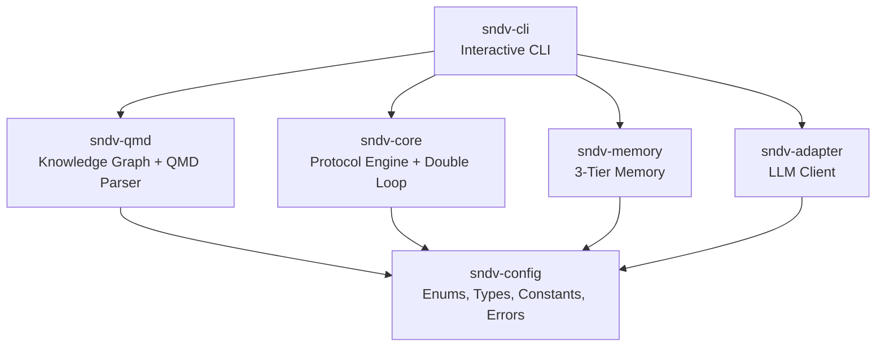
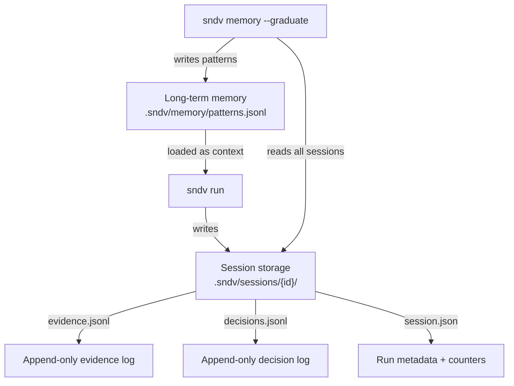

# sndv-nano by Radoslav Sandov

> Stop planning what could work. Start proving what can't fail.

## The idea in 30 seconds

Most planning asks "what steps do I need to succeed?"

SMEP asks **"what would make this fail — and can I make it fail?"**

You define **walls** (constraints), then systematically try to **break your own idea**. Whatever survives is your solution.

Think of it like a scientist: you don't prove a theory by finding evidence *for* it — you try every way to *disprove* it. Whatever you can't break is what you ship.

---

## Architecture



| Package | What |
|---|---|
| [config](packages/config/) | Shared enums, types, Zod schemas, error factories, constants |
| [core](packages/core/) | Core engine — Protocol, DoubleLoop, Scheduler, Runner |
| [memory](packages/memory/) | 3-tier memory: short-term (runtime), medium-term (sessions), long-term (patterns) |
| [adapter](packages/adapter/) | fetch()-based LLM client, opencode adapter, prompt builder |
| [qmd](packages/qmd/) | QMD parser + knowledge graph with search, cross-doc dependencies, persistence |
| [cli](packages/cli/) | CLI: `sndv init`, `sndv run`, `sndv propose`, `sndv task`, `sndv scaffold` |

---

## Install

### From source

```bash
# 1. Clone the repo
git clone https://github.com/thecharge/sndv-nano.git
cd sndv-nano

# 2. Install dependencies
bun install

# 3. Run the CLI directly (no build needed — Bun runs .ts natively)
bun run packages/cli/src/index.ts --help
bun run packages/cli/src/index.ts init --type greenfield --name my-feature
bun run packages/cli/src/index.ts run
bun run packages/cli/src/index.ts status
bun run packages/cli/src/index.ts memory --patterns

# 4. Or link it globally so `sndv` works from anywhere
bun link                              # registers the workspace
cd packages/cli && bun link           # exposes the `sndv` binary
sndv --help                           # now works globally

# 5. Configure your LLM provider (optional — defaults to Ollama localhost)
export SNDV_LLM_BASE_URL="http://localhost:11434/v1"
export SNDV_LLM_MODEL="llama3"
```

After cloning you can also import any package directly in your own scripts:

```typescript
// Uses the workspace's source .ts files — zero build step with Bun
import { Protocol, summary } from "./packages/core/src/index";
import { MemoryRepository } from "./packages/memory/src/index";
import { LlmClient } from "./packages/adapter/src/index";
```

---

## Quick start: Protocol

```typescript
import { Protocol, TaskContext, summary } from "./packages/core/src/index";

const protocol = new Protocol({
  goal: "Ship the feature by Friday",
  constraints: ["No breaking changes to public API"],
});

protocol.addTask(async (ctx: TaskContext) => {
  ctx.evidence("endpoints_affected", 0);
}, { name: "api_compat_check", risk: 0.9 });

protocol.addTask(async (ctx: TaskContext) => {
  const passed = true;
  ctx.evidence("tests_passed", passed);
  if (!passed) ctx.falsify("Tests failed");
}, { name: "integration_tests", risk: 0.5, dependsOn: ["api_compat_check"] });

const report = await protocol.execute();
console.log(summary(report));
```

## Quick start: Double Loop

Converging spiral: **Falsify → Deliver → Verify → Repeat**.

```typescript
import { DoubleLoop, TaskContext } from "./packages/core/src/index";

const loop = new DoubleLoop(
  { goal: "Build user auth", constraints: ["Must support MFA"] },
  { maxCycles: 3 },
);

loop.addFalsify(async (ctx: TaskContext) => {
  ctx.evidence("totp_works", true);
}, { name: "check_mfa", risk: 0.9 });

loop.addDeliver(async (ctx: TaskContext) => {
  ctx.evidence("artifact", "auth-module-v1");
}, { name: "build_auth", dependsOn: ["check_mfa"] });

loop.addVerify(async (ctx: TaskContext) => {
  ctx.evidence("audit", "passed");
}, { name: "verify_security", dependsOn: ["build_auth"] });

const cycles = await loop.run();
console.log(loop.summarize());
```

## Quick start: QMD Knowledge Graph

Index `.qmd` files into a searchable knowledge graph with cross-document dependency tracking.

```typescript
import { QmdKnowledgeGraph, parseQmd } from "./packages/qmd/src/index";

const graph = new QmdKnowledgeGraph();

// Index a directory of QMD files
await graph.indexDirectory("./specs");

// Search by text, risk level, tags, or task name
const results = graph.search({ text: "authentication", minRisk: 0.7 });
for (const r of results) {
  console.log(`${r.document.title} (score: ${r.score})`);
}

// Traverse cross-document dependencies
const deps = graph.getDependencies("spec-id");
const dependents = graph.getDependents("spec-id");

// Persist and reload
await graph.saveIndex(".sndv/qmd-index.json");
await graph.loadIndex(".sndv/qmd-index.json");
```

## CLI

```bash
sndv --version              # print version

# Configure your LLM (any OpenAI-compatible endpoint)
export SNDV_LLM_API_KEY="your-key"          # required for LLM mode
export SNDV_LLM_BASE_URL="http://localhost:11434/v1"  # default: Ollama
export SNDV_LLM_MODEL="llama3"              # default: "default"

# Project setup
sndv init --type greenfield --name my-feature
sndv scaffold all           # generate CLAUDE.md, copilot-instructions.md, AGENTS.md
sndv scaffold all --force   # overwrite existing instruction files

# Shell autocompletion
sndv completion bash >> ~/.bashrc
sndv completion zsh >> ~/.zshrc
sndv completion fish > ~/.config/fish/completions/sndv.fish

# Let the LLM propose tasks from your goal
sndv propose --goal "Build a rate limiter that survives burst traffic"
sndv propose --goal "Migrate auth" --type brownfield
sndv propose --goal-file vision.md   # read a large goal from a file
sndv propose --goal "Add MFA" --append  # append tasks to existing protocol

# Manage tasks directly
sndv task list
sndv task add --name verify_redis --risk 0.9 --description "Break the Redis pool"
sndv task add --name verify_rate --risk 0.7 --depends-on verify_redis
sndv task remove --name verify_rate

# Run
sndv run                    # LLM evaluates each task
sndv run --no-llm           # offline mode
sndv run --dry-run           # preview task graph without executing

# Review
sndv status                 # view hypotheses + patterns
sndv memory --export my-id  # export context for external LLM
sndv memory --patterns      # view institutional patterns
sndv memory --graduate      # extract patterns from repeated failures

# Archive and restore protocols
sndv protocol list           # show current and archived protocols
sndv protocol archive --name v1  # archive current protocol
sndv protocol restore --name v1  # restore an archived protocol
```

---

## Memory system

```
LONG-TERM     .sndv/memory/patterns.jsonl    Cross-hypothesis. Forever.
MEDIUM-TERM   .sndv/sessions/{id}/*.jsonl    Per-hypothesis. Across runs.
SHORT-TERM    In-memory Map                  Dies when process exits.
```

```typescript
import { MemoryRepository } from "./packages/memory/src/index";

const mem = new MemoryRepository({ root: ".sndv" });
await mem.init();

const fragment = await mem.exportForLlm("my-hypothesis");
await mem.sessions.recordRun("my-hypothesis", report);
const patterns = await mem.graduatePatterns();
```

---

## LLM integration

fetch()-based, vendor-agnostic. Provider auto-detected from base URL. No SDK dependency.

### Supported providers

| Provider | `SNDV_LLM_BASE_URL` | `SNDV_LLM_MODEL` | `SNDV_LLM_API_KEY` |
|---|---|---|---|
| Ollama (default) | `http://localhost:11434/v1` | `llama3` | not required |
| OpenAI | `https://api.openai.com/v1` | `gpt-4o-mini` | `sk-...` |
| Google Gemini | `https://generativelanguage.googleapis.com/v1beta/openai` | `gemini-2.0-flash` | Google API key |
| xAI Grok | `https://api.x.ai/v1` | `grok-2` | `xai-...` |
| Anthropic Claude | `https://api.anthropic.com` | `claude-sonnet-4-20250514` | `sk-ant-...` |
| OpenRouter | `https://openrouter.ai/api/v1` | `anthropic/claude-sonnet-4-20250514` | `sk-or-v1-...` |
| Together AI | `https://api.together.xyz/v1` | `meta-llama/Llama-3.3-70B-Instruct-Turbo` | key |
| LM Studio | `http://localhost:1234/v1` | `local-model` | not required |

Anthropic Claude uses native Messages API (auto-detected from URL). All others use OpenAI-compatible format. OpenRouter adds `HTTP-Referer` and `X-Title` headers automatically.

### Quick setup per provider

```bash
# Ollama (local, free)
export SNDV_LLM_BASE_URL="http://localhost:11434/v1"
export SNDV_LLM_MODEL="llama3"

# OpenAI
export SNDV_LLM_BASE_URL="https://api.openai.com/v1"
export SNDV_LLM_API_KEY="sk-..."
export SNDV_LLM_MODEL="gpt-4o-mini"

# Google Gemini
export SNDV_LLM_BASE_URL="https://generativelanguage.googleapis.com/v1beta/openai"
export SNDV_LLM_API_KEY="your-google-api-key"
export SNDV_LLM_MODEL="gemini-2.0-flash"

# Anthropic Claude (native API)
export SNDV_LLM_BASE_URL="https://api.anthropic.com"
export SNDV_LLM_API_KEY="sk-ant-..."
export SNDV_LLM_MODEL="claude-sonnet-4-20250514"

# xAI Grok
export SNDV_LLM_BASE_URL="https://api.x.ai/v1"
export SNDV_LLM_API_KEY="xai-..."
export SNDV_LLM_MODEL="grok-2"

# OpenRouter (access ANY model)
export SNDV_LLM_BASE_URL="https://openrouter.ai/api/v1"
export SNDV_LLM_API_KEY="sk-or-v1-..."
export SNDV_LLM_MODEL="anthropic/claude-sonnet-4-20250514"
```

### Programmatic usage

```typescript
import { LlmClient } from "./packages/adapter/src/index";

const client = new LlmClient({ model: "gpt-4o-mini" });
const response = await client.chat([
  { role: "system", content: "You are a SMEP evaluator." },
  { role: "user", content: "Can this API handle 10k req/s?" },
]);

const verdict = await client.judgeTask(systemPrompt, "task_name", "description", memoryContext);
```

---

## Examples

| Example | What |
|---|---|
| `examples/greenfield/` | Simple Protocol — avatar upload |
| `examples/brownfield/` | Brownfield — auth migration |
| `examples/prd-review/` | Double Loop — attack a PRD |
| `examples/business-exploration/` | Protocol — falsify a SaaS idea |
| `examples/ops-pipeline/` | Double Loop — K8s deployment |
| `examples/customer-support/` | Double Loop + Memory — AI support with learning |

```bash
bun run examples/prd-review/run.ts
bun run examples/customer-support/run.ts
```

---

## Demo: End-to-end microservice setup

Run the full workflow (init → scaffold → propose → run → review) in a clean workspace:

```bash
bash demo/end-to-end-microservice.sh
```

If you do not have LLM env vars set, the demo falls back to a local protocol template.

### More demos

```bash
bash demo/standalone.sh
bash demo/codex-demo.sh
bash demo/claude-code-demo.sh
bash demo/copilot-demo.sh
```

---

## How is this built

### Toolchain

| Tool | Role |
|---|---|
| [Bun](https://bun.sh) | Runtime, test runner, package manager |
| [TypeScript](https://www.typescriptlang.org/) | Strict mode, ESNext, composite project references, bundler resolution |
| [Biome](https://biomejs.dev/) | Formatting (tabs, 100 cols) + linting (recommended + cognitive complexity) |
| [cspell](https://cspell.org/) | Spell checking across `.ts` and `.md` files |
| [Lefthook](https://github.com/evilmartians/lefthook) | Git hooks — runs on every commit and push |
| [Secretlint](https://github.com/secretlint/secretlint) | Scans for leaked API keys, tokens, credentials |

### Pre-commit hooks (automatic via lefthook)

Every `git commit` runs these in parallel:

| Hook | What it does |
|---|---|
| `format` | Biome auto-formats staged `.ts` files and re-stages |
| `lint` | Biome lints staged `.ts` files |
| `spellcheck` | cspell checks staged `.ts` and `.md` |
| `typecheck` | `tsc --noEmit` across all packages |
| `test` | `bun test --recursive` — full test suite |
| `secrets` | Secretlint scans staged files for leaked credentials |

Every `git push` runs a full `bun run check` + secrets scan on the entire repo.

If any hook fails, the commit/push is blocked.

### Local validation

```bash
bun install              # install deps + activate lefthook hooks
bun run check            # lint + typecheck + test (same as pre-push)
bun run secrets          # scan entire repo for leaked secrets
bun run test:coverage    # tests with coverage report
```

### Build pipeline

```bash
# 1. Clean build (removes all dist/ and .tsbuildinfo)
bun run build:clean

# 2. Incremental build
bun run build

# 3. Full validation
bun run prepublish:all   # clean build + lint + typecheck + test
```

TypeScript compiles each package via `tsc -b` (composite project references). Output goes to `packages/*/dist/`. Source `.ts` stays in `packages/*/src/`.

### Monorepo dependency order

```
config    ← no internal deps
    ↑
core      ← depends on config
memory    ← depends on config
adapter   ← depends on config
qmd       ← depends on config
    ↑
cli       ← depends on ALL above
```

---

## Goal lifecycle

A **goal** is a hypothesis you are trying to falsify. You define it in `protocol.qmd` along with constraints and risk-ordered tasks.

### What happens when you run

1. The scheduler sorts tasks by **risk descending** (highest risk first — fail-fast strategy)
2. Tasks with satisfied dependencies run in parallel batches
3. Each task either **verifies** (could not break it) or **falsifies** (found a way to break it)
4. After each batch, **pruning** propagates: if a task is falsified/errored, all downstream dependents are automatically **skipped**
5. When no more tasks are pending, the protocol resolves

### How a goal completes

| All tasks verified | → `VERIFIED` — the hypothesis survived all attacks |
|---|---|
| **Any task falsified** | → `FALSIFIED` — the hypothesis has a known weakness |
| **Tasks errored (none falsified)** | → `ERRORED` — evaluation itself failed |

The result is an `ExecutionReport`:

```
Goal:        Build a rate limiter that survives burst traffic
Outcome:     VERIFIED
Iterations:  3
Duration:    1.42s
Tasks:       3
  verified:  3
  falsified: 0
  skipped:   0
Surviving path:
  ✓ verify_redis_connection
  ✓ verify_rate_accuracy
  ✓ verify_burst_handling
```

### What happens next

SNDV does **not** auto-advance to a next goal. Each protocol run is independent. After a run:

1. Results are persisted to `.sndv/sessions/{hypothesis_id}/`
2. You review the report — `sndv status`
3. You edit `protocol.qmd` — add tasks, change risk scores, adjust constraints
4. You run again — results **accumulate** across runs (session memory appends)
5. Over time, `sndv memory --graduate` extracts patterns from repeated failures

The workflow is iterative: **define → attack → review → refine → attack again**.

---

## Task breakdown and risk

### Defining tasks in protocol.qmd

Each task is a `# Task:` heading in the protocol file:

```yaml
---
goal: "Ship the feature by Friday"
constraints:
  - "No breaking changes to public API"
---

# Task: api_compat_check
risk: 0.9

Prove the new endpoints break backward compatibility.

# Task: integration_tests
risk: 0.5
depends_on: [api_compat_check]

Run the integration suite and find failures.

# Task: load_test
risk: 0.3
depends_on: [integration_tests]

Try to make the service fall over under 10k req/s.
```

### What risk means

**Risk** is a number from `0.0` to `1.0` that you assign to each task. It represents how likely you think this task will **falsify** the hypothesis.

- `0.9` — "I strongly suspect this will fail" → evaluate first
- `0.5` — default, no strong opinion
- `0.1` — "This is probably fine" → evaluate last

The scheduler sorts tasks by risk **descending**. Higher-risk tasks execute first. This is a **fail-fast** strategy: if the riskiest assumption breaks, all its dependents are pruned immediately, saving time.

Risk is **not computed automatically**. You set it based on your judgment. After running, review the results and adjust risk scores for the next run.

### How tasks depend on each other

Use `depends_on: [task_name]` to declare dependencies. A task only runs when all its dependencies are `VERIFIED`. If any dependency is falsified, errored, or timed out, the task is automatically **skipped** (pruned).

Pruning is **transitive**: if A fails → B is skipped → C (which depends on B) is also skipped.

### Task statuses

| Status | Meaning |
|---|---|
| `pending` | Not yet evaluated |
| `running` | Currently being evaluated |
| `verified` | Could not break it — assumption holds |
| `falsified` | Found evidence that breaks it |
| `errored` | Evaluation itself failed (exception, timeout in LLM) |
| `skipped` | Pruned because an upstream dependency failed |
| `timed_out` | Evaluation exceeded the time limit |

---

## Where results go

Every `sndv run` writes results to disk. Nothing is lost.

### Session storage: `.sndv/sessions/{hypothesis_id}/`

| File | Format | What it stores |
|---|---|---|
| `session.json` | JSON | Metadata: hypothesis ID, goal, created timestamp, run count, last run time, last status |
| `evidence.jsonl` | JSONL (append-only) | One line per evidence key-value from each task: `{ key, value, task, hypothesisId, timestamp, runId, status }` |
| `decisions.jsonl` | JSONL (append-only) | One line per task result: `{ task, action, reason, evidence, timestamp, runId }` |

Evidence and decisions are **append-only** — every run adds lines, nothing is overwritten. You get a full history of every evaluation across all runs.

### Long-term memory: `.sndv/memory/`

| File | What |
|---|---|
| `patterns.jsonl` | Recurring failure patterns extracted from session data |
| `constraints.jsonl` | Learned constraints from past evaluations |

### How patterns graduate

Run `sndv memory --graduate` to scan all sessions for repeated failures:

1. Collects all `FALSIFIED` decisions across all hypotheses
2. Groups by normalized failure reason (numbers stripped, lowercased)
3. If a failure reason appears **3 or more times** across different hypotheses → creates a pattern
4. Pattern includes: confidence score, occurrence count, source hypotheses, auto-generated tags

Patterns are loaded as context in future runs. The system learns from repeated mistakes.

### The full data flow



---

## Docs

- [Developer Guide](docs/dev-guide.md) — Monorepo structure, adding packages, code conventions
- [Agent Integration](docs/agent-integration.md) — Claude Code, Copilot, opencode, self-improvement loops
- [Contributing](CONTRIBUTING.md) — Code standards, branch workflow, PR checklist
- [Security](SECURITY.md) — Vulnerability reporting, security hardening

---
## License

MIT