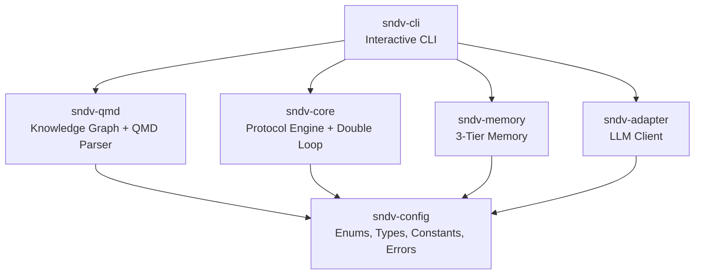
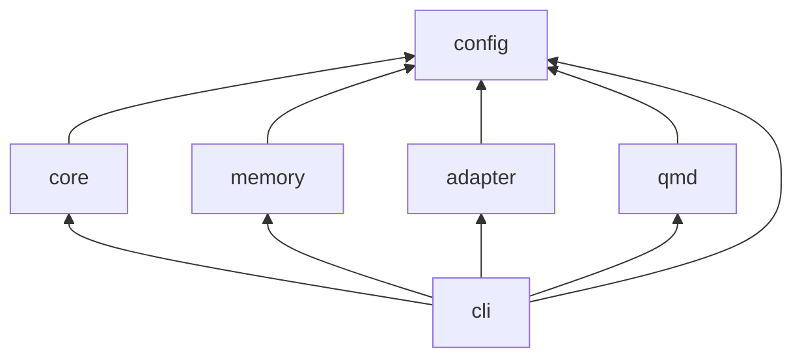
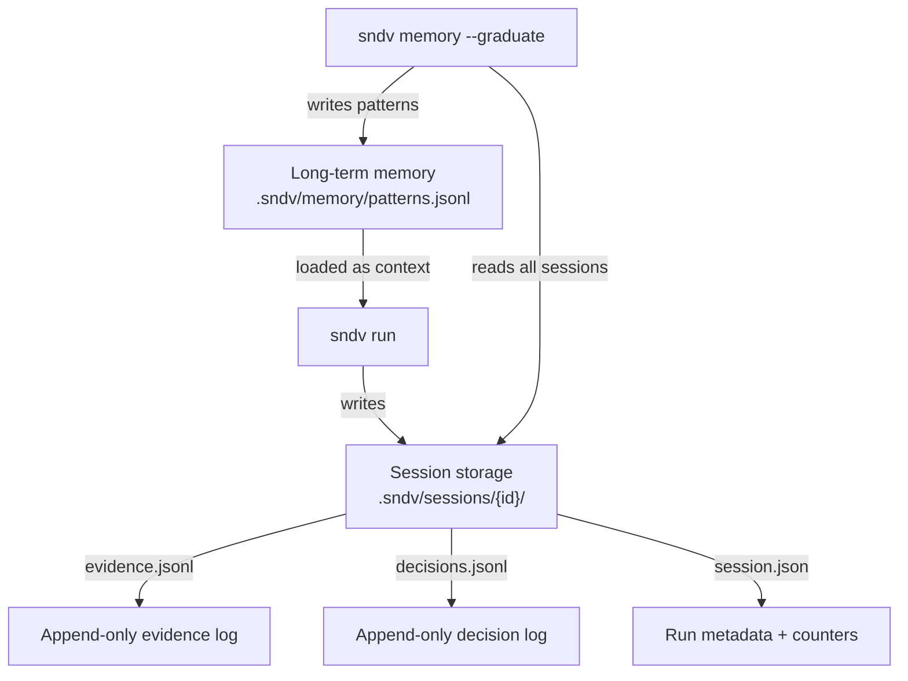

# sndv-nano

> Stop planning what could work. Start proving what cannot fail.

SNDV implements SMEP (Self-Managing Execution Protocol): a falsification-first workflow that makes you attack your own assumptions before you build. You define constraints, order tasks by risk, and try to break the plan. Whatever survives is what ships.

## Why SMEP

- Planning asks: what do I need to do to succeed?
- SMEP asks: what would make this fail, and can I make it fail?

It is the scientific method applied to engineering: you do not prove a theory by looking for confirmation, you try to disprove it. Whatever you cannot disprove is the only thing worth shipping.

## Quick start (CLI)

```bash
git clone https://github.com/thecharge/sndv-nano.git
cd sndv-nano
bun install

# Run the CLI directly (Bun runs .ts)
bun run packages/cli/src/index.ts --help

# Initialize a protocol
bun run packages/cli/src/index.ts init --type greenfield --name my-project

# Propose tasks from a goal (LLM optional)
bun run packages/cli/src/index.ts propose --goal "Ship a rate limiter"

# Execute and review
bun run packages/cli/src/index.ts run
bun run packages/cli/src/index.ts status
```

## Install globally (local symlink)

Build the CLI and create a user-level symlink at the default path (`~/.local/bin/sndv`).

```bash
bun run build
bun run packages/cli/src/index.ts link
sndv --help
```

If you want a custom path:

```bash
bun run packages/cli/src/index.ts link --path ~/bin/sndv
```

## CLI usage

```bash
sndv --version

# Configure your LLM provider (optional)
export SNDV_LLM_API_KEY="your-key"
export SNDV_LLM_BASE_URL="http://localhost:11434/v1"  # default: Ollama
export SNDV_LLM_MODEL="llama3"                        # default: "default"

# Project setup
sndv init --type greenfield --name my-project
sndv scaffold all
sndv scaffold all --force

# Shell autocompletion
sndv completion bash >> ~/.bashrc
sndv completion zsh >> ~/.zshrc
sndv completion fish > ~/.config/fish/completions/sndv.fish

# Generate tasks from a goal
sndv propose --goal "Build a rate limiter that survives burst traffic"
sndv propose --goal "Migrate auth" --type brownfield
sndv propose --goal-file vision.md
sndv propose --goal "Add MFA" --append

# Manage tasks
sndv task list
sndv task add --name verify_redis --risk 0.9 --description "Break the Redis pool"
sndv task add --name verify_rate --risk 0.7 --depends-on verify_redis
sndv task remove --name verify_rate

# Run and review
sndv run
sndv run --no-llm
sndv run --dry-run
sndv status
sndv memory --export my-id
sndv memory --patterns
sndv memory --graduate

# Archive and restore protocols
sndv protocol list
sndv protocol archive --name v1
sndv protocol restore --name v1
```

## Architecture



| Package | Purpose |
|---|---|
| [config](packages/config/) | Enums, types, schemas, constants, error factories |
| [core](packages/core/) | Protocol engine and Double Loop |
| [memory](packages/memory/) | 3-tier memory (short-term, sessions, long-term) |
| [adapter](packages/adapter/) | LLM client and prompt builder |
| [qmd](packages/qmd/) | QMD parser and knowledge graph |
| [cli](packages/cli/) | CLI entry and commands |

## Examples

```bash
bun run examples/greenfield/feature.ts
bun run examples/brownfield/auth-migration.ts
bun run examples/prd-review/run.ts
bun run examples/business-exploration/run.ts
bun run examples/ops-pipeline/run.ts
bun run examples/customer-support/run.ts
```

## Demos

```bash
bash demo/end-to-end-microservice.sh
bash demo/standalone.sh
bash demo/codex-demo.sh
bash demo/claude-code-demo.sh
bash demo/copilot-demo.sh
```

## LLM configuration

SNDV is vendor-agnostic. It auto-detects provider by base URL and speaks OpenAI-compatible HTTP. Anthropic uses native Messages API when the URL matches.

| Provider | SNDV_LLM_BASE_URL | SNDV_LLM_MODEL | Auth |
|---|---|---|---|
| Ollama (default) | http://localhost:11434/v1 | llama3 | none |
| OpenAI | https://api.openai.com/v1 | gpt-4o-mini | sk-... |
| Google Gemini | https://generativelanguage.googleapis.com/v1beta/openai | gemini-2.0-flash | API key |
| xAI Grok | https://api.x.ai/v1 | grok-2 | xai-... |
| Anthropic Claude | https://api.anthropic.com | claude-sonnet-4-20250514 | sk-ant-... |
| OpenRouter | https://openrouter.ai/api/v1 | anthropic/claude-sonnet-4-20250514 | sk-or-v1-... |
| Together AI | https://api.together.xyz/v1 | meta-llama/Llama-3.3-70B-Instruct-Turbo | key |
| LM Studio | http://localhost:1234/v1 | local-model | none |

## Developer workflow

```bash
bun install
bun run lint
bun run typecheck
bun run test
bun run check          # lint + typecheck + test
bun run build:clean    # clean build
bun run build          # incremental build
bun run prepublish:all # clean build + lint + typecheck + test
```

More details:

- [Contributing](CONTRIBUTING.md)
- [Developer guide](docs/dev-guide.md)
- [Agent integration](docs/agent-integration.md)
- [Publishing](docs/publishing.md)

### Monorepo dependency order



---

## Goal lifecycle

A **goal** is a hypothesis you are trying to falsify. You define it in `protocol.qmd` along with constraints and risk-ordered tasks.

### What happens when you run

1. The scheduler sorts tasks by **risk descending** (highest risk first - fail-fast strategy)
2. Tasks with satisfied dependencies run in parallel batches
3. Each task either **verifies** (could not break it) or **falsifies** (found a way to break it)
4. After each batch, **pruning** propagates: if a task is falsified/errored, all downstream dependents are automatically **skipped**
5. When no more tasks are pending, the protocol resolves

### How a goal completes

|All tasks verified | -> `VERIFIED` - the hypothesis survived all attacks |
|---|---|
| **Any task falsified** | -> `FALSIFIED` - the hypothesis has a known weakness |
| **Tasks errored (none falsified)** | -> `ERRORED` - evaluation itself failed |

The result is an `ExecutionReport`:

```
Goal:        Build a rate limiter that survives burst traffic
Outcome:     VERIFIED
Iterations:  3
Duration:    1.42s
Tasks:       3
  verified:  3
  falsified: 0
  skipped:   0
Surviving path:
  ✓ verify_redis_connection
  ✓ verify_rate_accuracy
  ✓ verify_burst_handling
```

### What happens next

SNDV does **not** auto-advance to a next goal. Each protocol run is independent. After a run:

1. Results are persisted to `.sndv/sessions/{hypothesis_id}/`
2. You review the report - `sndv status`
3. You edit `protocol.qmd` - add tasks, change risk scores, adjust constraints
4. You run again - results **accumulate** across runs (session memory appends)
5. Over time, `sndv memory --graduate` extracts patterns from repeated failures

The workflow is iterative: **define -> attack -> review -> refine -> attack again**.

---

## Task breakdown and risk

### Defining tasks in protocol.qmd

Each task is a `# Task:` heading in the protocol file:

```yaml
---
goal: "Ship the feature by Friday"
constraints:
  - "No breaking changes to public API"
---

# Task: api_compat_check
risk: 0.9

Prove the new endpoints break backward compatibility.

# Task: integration_tests
risk: 0.5
depends_on: [api_compat_check]

Run the integration suite and find failures.

# Task: load_test
risk: 0.3
depends_on: [integration_tests]

Try to make the service fall over under 10k req/s.
```

### What risk means

**Risk** is a number from `0.0` to `1.0` that you assign to each task. It represents how likely you think this task will **falsify** the hypothesis.

- `0.9` - "I strongly suspect this will fail" -> evaluate first
- `0.5` - default, no strong opinion
- `0.1` - "This is probably fine" -> evaluate last

The scheduler sorts tasks by risk **descending**. Higher-risk tasks execute first. This is a **fail-fast** strategy: if the riskiest assumption breaks, all its dependents are pruned immediately, saving time.

Risk is **not computed automatically**. You set it based on your judgment. After running, review the results and adjust risk scores for the next run.

### How tasks depend on each other

Use `depends_on: [task_name]` to declare dependencies. A task only runs when all its dependencies are `VERIFIED`. If any dependency is falsified, errored, or timed out, the task is automatically **skipped** (pruned).

Pruning is **transitive**: if A fails -> B is skipped -> C (which depends on B) is also skipped.

### Task statuses

| Status | Meaning |
|---|---|
| `pending` | Not yet evaluated |
| `running` | Currently being evaluated |
| `verified` | Could not break it - assumption holds |
| `falsified` | Found evidence that breaks it |
| `errored` | Evaluation itself failed (exception, timeout in LLM) |
| `skipped` | Pruned because an upstream dependency failed |
| `timed_out` | Evaluation exceeded the time limit |

---

## Where results go

Every `sndv run` writes results to disk. Nothing is lost.

### Session storage: `.sndv/sessions/{hypothesis_id}/`

| File | Format | What it stores |
|---|---|---|
| `session.json` | JSON | Metadata: hypothesis ID, goal, created timestamp, run count, last run time, last status |
| `evidence.jsonl` | JSONL (append-only) | One line per evidence key-value from each task: `{ key, value, task, hypothesisId, timestamp, runId, status }` |
| `decisions.jsonl` | JSONL (append-only) | One line per task result: `{ task, action, reason, evidence, timestamp, runId }` |

Evidence and decisions are **append-only** - every run adds lines, nothing is overwritten. You get a full history of every evaluation across all runs.

### Long-term memory: `.sndv/memory/`

| File | What |
|---|---|
| `patterns.jsonl` | Recurring failure patterns extracted from session data |
| `constraints.jsonl` | Learned constraints from past evaluations |

### How patterns graduate

Run `sndv memory --graduate` to scan all sessions for repeated failures:

1. Collects all `FALSIFIED` decisions across all hypotheses
2. Groups by normalized failure reason (numbers stripped, lowercased)
3. If a failure reason appears **3 or more times** across different hypotheses -> creates a pattern
4. Pattern includes: confidence score, occurrence count, source hypotheses, auto-generated tags

Patterns are loaded as context in future runs. The system learns from repeated mistakes.

### The full data flow



---

## Docs

- [Developer Guide](docs/dev-guide.md) - Monorepo structure, adding packages, code conventions
- [Agent Integration](docs/agent-integration.md) - Claude Code, Copilot, opencode, self-improvement loops
- [Contributing](CONTRIBUTING.md) - Code standards, branch workflow, PR checklist
- [Security](SECURITY.md) - Vulnerability reporting, security hardening

---
## License

MIT