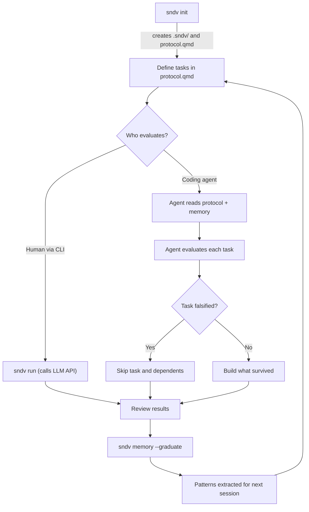
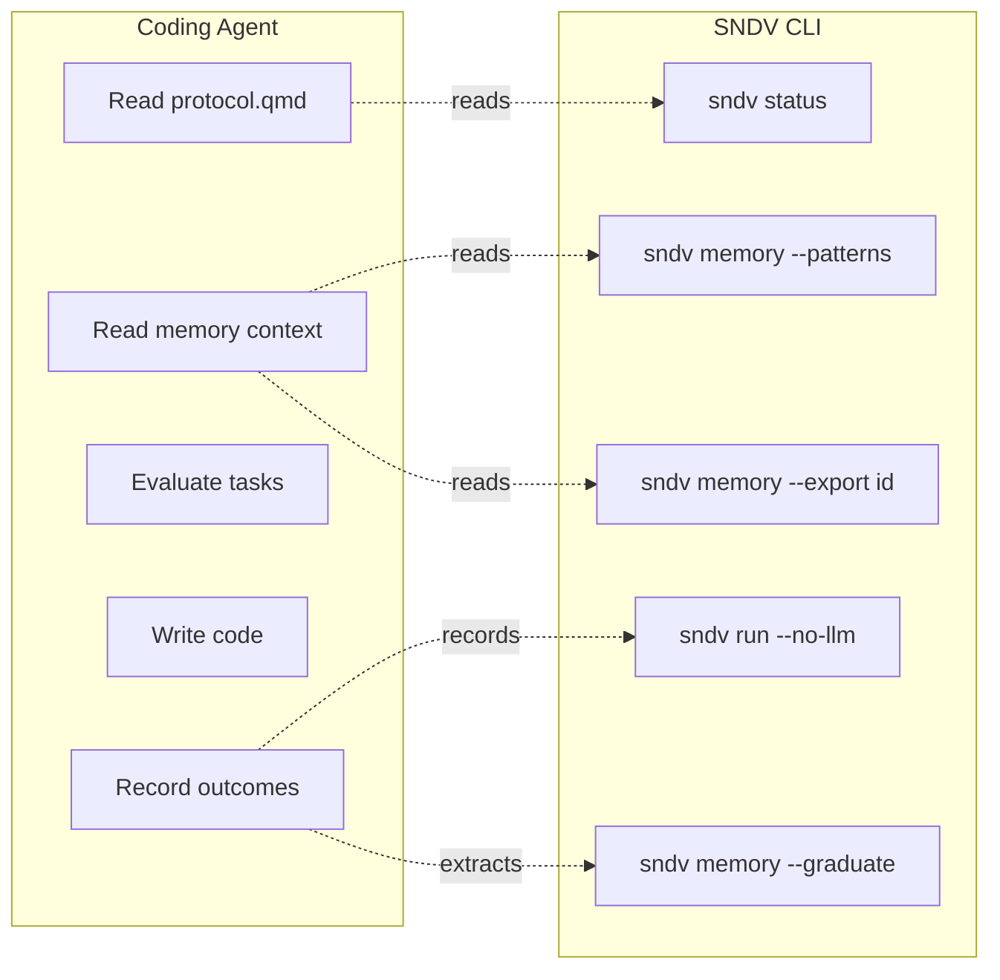
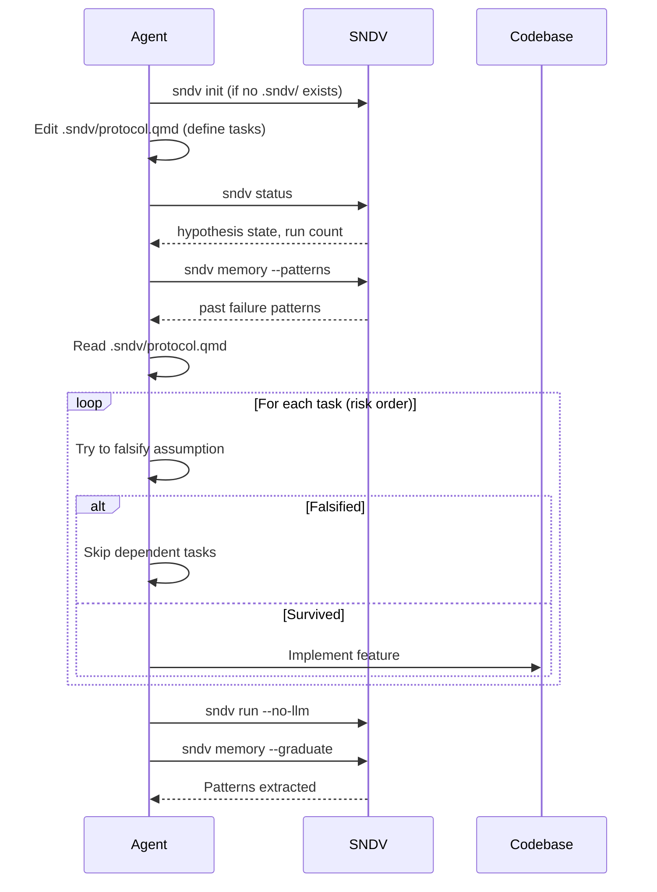
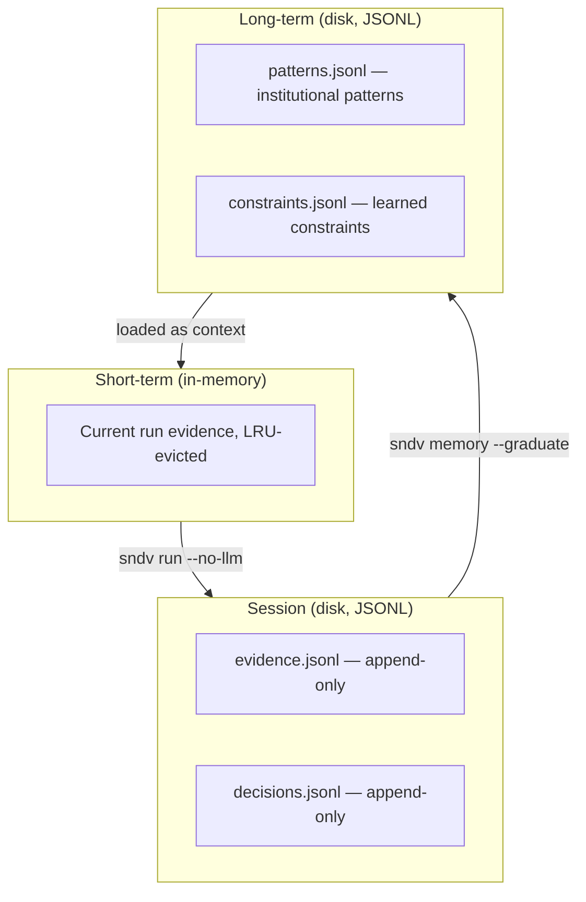

# Agent Integration Guide

SNDV (Self-Managing Execution Protocol) is a CLI tool that structures work around falsification-first reasoning. It defines protocols with risk-ordered tasks, tracks what failed before, and graduates patterns across sessions.

This guide covers the full lifecycle: install SNDV globally, use it with any project, create and refine protocols, evaluate tasks, and integrate with coding agents like Claude Code, GitHub Copilot, and opencode.

## Install SNDV globally

Clone the repo and link the CLI so it is available in any workspace:

```bash
git clone https://github.com/thecharge/sndv-nano.git
cd sndv-nano
bun install
bun link
```

After linking, the `sndv` command is available in your shell. Navigate to any project and use it:

```bash
cd ~/my-other-project
sndv init
sndv status
```

## Full lifecycle



### Step 1: Initialize

```bash
cd ~/your-project
sndv init --type greenfield --name my-project
```

This creates:

```
.sndv/
  config.json       # project metadata
  protocol.qmd      # protocol definition (edit this)
  long-term/         # persistent memory dir
```

The generated `protocol.qmd` is a template. You must edit it to define your actual goal, constraints, and tasks.

### Step 2: Define the protocol

Edit `.sndv/protocol.qmd`. The format is YAML frontmatter + markdown task blocks:

```yaml
---
goal: "Build a rate limiter that survives burst traffic"
type: greenfield
max_iterations: 10
constraints:
  - "Must handle 10k req/s sustained"
  - "No external dependencies beyond Redis"
---

# Task: verify_redis_connection
risk: 0.9

Try to break the Redis connection pool under concurrent load.

# Task: verify_rate_accuracy
risk: 0.7
depends_on: [verify_redis_connection]

Prove the limiter miscounts under edge cases (clock skew, race conditions).

# Task: verify_burst_handling
risk: 0.5
depends_on: [verify_rate_accuracy]

Try to exceed the rate limit with burst patterns.
```

Tasks are ordered by `risk` (0.0–1.0). Higher risk = evaluate first. If a task is falsified, skip all dependents.

### Step 3: Evaluate

Two modes:

| Mode | Command | Who reasons |
|---|---|---|
| **With LLM** | `sndv run` | LLM API (configured via `SNDV_LLM_*` env vars) |
| **Offline** | `sndv run --no-llm` | Records structure only — no LLM call |
| **Inside agent** | Agent reads protocol directly | Agent is the evaluator |

### Step 4: Review and refine

```bash
sndv status                        # hypothesis state, run count, outcomes
sndv memory --patterns             # what keeps failing
sndv memory --export "hypothesis"  # full context for a hypothesis
```

Edit `protocol.qmd` to add, remove, or reorder tasks based on what you learned. Run again.

### Step 5: Graduate patterns

```bash
sndv memory --graduate
```

Extracts recurring failure patterns from session data into `patterns.jsonl`. These patterns are loaded as context in future runs, so the same mistakes are not repeated.

## The agent is the evaluator

When a coding agent uses SNDV, there is no reason to call a second LLM. The agent reads the protocol, evaluates each task with its own reasoning, and uses SNDV commands to read history and record outcomes. SNDV provides structure (protocol, memory, patterns) — the agent provides the brain.



The agent does **not** run `sndv run` (which calls a second LLM). It runs `sndv run --no-llm` or reads the protocol directly.

## Claude Code

Claude Code uses `CLAUDE.md` files for project instructions and can run shell commands directly.

**How it works**: Claude Code reads `CLAUDE.md` at session start. It can run `sndv` commands via its Bash tool and read `.sndv/protocol.qmd` via its Read tool. No plugins or MCP servers needed.

### Setup

Create a `CLAUDE.md` file in your project root (or `.claude/CLAUDE.md`):

```markdown
## SNDV Protocol

This project uses SNDV for falsification-first structured execution.
You are the evaluator — do not call `sndv run` (that invokes a second LLM).

### Before building

1. Run `sndv status` to check hypothesis state and prior runs
2. Run `sndv memory --patterns` to see what has failed before — avoid those
3. Read `.sndv/protocol.qmd` to see tasks ordered by risk

### Workflow

- Work through tasks in risk order (highest risk first)
- For each task, try to BREAK the assumption — not confirm it
- If you falsify a task, skip all tasks that depend on it
- Build only what survives falsification
- After finishing, run `sndv memory --graduate` to extract patterns

### Creating a new protocol

If no `.sndv/` directory exists, run `sndv init` first.
Edit `.sndv/protocol.qmd` to define your goal, constraints, and tasks.
Each task needs a `risk` score (0.0–1.0) and a description of what to try to break.

### Recording results

Run `sndv run --no-llm` to record the protocol execution offline.
Run `sndv memory --graduate` to extract institutional patterns.
```

Claude Code reads this file at session start and follows the instructions.

Alternatively, use `.claude/rules/` for scoped rules:

```markdown
# .claude/rules/sndv.md
---
paths:
  - ".sndv/**"
---

When editing files in .sndv/, follow the protocol.qmd format.
Tasks must have a risk score and a description of what to falsify.
Use `sndv status` to verify changes after editing.
```

### Automation with hooks

Claude Code supports hooks that run shell commands at lifecycle points. Use a `PostToolUse` hook to auto-check SNDV status after file writes:

```json
{
  "hooks": {
    "PostToolUse": [
      {
        "matcher": "Write|Edit",
        "hooks": [
          {
            "type": "command",
            "command": "sndv status 2>/dev/null || true",
            "async": true
          }
        ]
      }
    ]
  }
}
```

Place this in `.claude/settings.json` (project-scoped) or `.claude/settings.local.json` (personal).

## GitHub Copilot

GitHub Copilot uses `.github/copilot-instructions.md` for repository-wide instructions and `AGENTS.md` for agent-mode instructions. In VS Code, Copilot agent mode can run terminal commands and edit files.

**How it works**: Copilot reads instruction files automatically. In agent mode (VS Code), it can execute `sndv` commands in the integrated terminal. On github.com (Copilot coding agent), it runs in a container with shell access.

### Setup

Create `.github/copilot-instructions.md`:

```markdown
## SNDV Protocol

This project uses SNDV for structured falsification-first execution.
SNDV is installed globally via `bun link` from the sndv-nano repository.

### Commands

- `sndv status` — show hypothesis state and run history
- `sndv memory --patterns` — list recurring failure patterns (avoid repeating these)
- `sndv memory --export <id>` — export full context for a hypothesis
- `sndv run --no-llm` — record protocol execution offline (no LLM call)
- `sndv memory --graduate` — extract patterns from session data

### Workflow

1. Run `sndv status` first
2. Run `sndv memory --patterns` to see past failures
3. Read `.sndv/protocol.qmd` for task list ordered by risk
4. For each task (highest risk first), try to falsify the assumption
5. Build only what survives
6. Run `sndv memory --graduate` when done

### Creating a protocol

Run `sndv init` to create `.sndv/protocol.qmd`, then edit it with your goal, constraints, and tasks.

Do NOT run `sndv run` — that calls a second LLM. You are the evaluator.
```

For path-specific instructions, create `.github/instructions/sndv.instructions.md`:

```markdown
---
applyTo: ".sndv/**"
---

Files in `.sndv/` are SNDV protocol files. `protocol.qmd` uses YAML frontmatter
(goal, type, max_iterations, constraints) and markdown task blocks
(`# Task: name` with `risk:` and optional `depends_on:`).
Do not delete or restructure the `.sndv/` directory.
```

Copilot also reads `AGENTS.md` if present (see opencode section below — `AGENTS.md` is shared between tools).

## opencode

opencode uses `AGENTS.md` for project rules and supports custom agents via markdown files in `.opencode/agents/`. It can run shell commands via its bash tool.

**How it works**: opencode reads `AGENTS.md` at session start. Run `/init` in opencode to auto-generate one, or create it manually. Custom agents and instructions in `.opencode/` are loaded automatically.

### Setup

Create `AGENTS.md` in the project root:

```markdown
## SNDV Protocol

This project uses SNDV for structured falsification-first execution.
SNDV is installed globally (`sndv` command available in shell).

### Before building

1. `sndv status` — check hypothesis state
2. `sndv memory --patterns` — see repeated failures (do NOT repeat these)
3. Read `.sndv/protocol.qmd` — tasks ordered by risk

### Workflow

- Work tasks in risk order, highest first
- Try to BREAK each assumption, not confirm it
- Skip dependent tasks if a task is falsified
- Build only what survives
- `sndv memory --graduate` when finished

### Creating a protocol

If `.sndv/` does not exist: `sndv init --type greenfield --name my-project`
Edit `.sndv/protocol.qmd` with your goal, constraints, and risk-ordered tasks.

### Recording

- `sndv run --no-llm` — record execution offline
- `sndv memory --graduate` — extract patterns from sessions

Do NOT run `sndv run` (calls a second LLM — you are the evaluator).
```

`AGENTS.md` is also read by GitHub Copilot and (as a fallback) Claude Code, so one file works for multiple tools.

### Custom agent for SNDV evaluation

Create `.opencode/agents/sndv-eval.md`:

```markdown
---
description: Evaluates SNDV protocol tasks using falsification-first approach
mode: subagent
permission:
  bash:
    "sndv *": allow
    "cat .sndv/*": allow
    "*": ask
  edit: ask
---

You are evaluating a SNDV protocol. For each task in `.sndv/protocol.qmd`:

1. Read the task description
2. Try to falsify the assumption — find a way to break it
3. If you falsify it, report the evidence and skip dependent tasks
4. If you cannot falsify it, proceed to implement

Run `sndv status` first. Run `sndv memory --patterns` to avoid past mistakes.
After evaluation, run `sndv memory --graduate`.
```

Invoke this agent with `@sndv-eval` in an opencode session.

### Additional instructions via config

Add SNDV docs as extra instruction files in `opencode.json`:

```json
{
  "$schema": "https://opencode.ai/config.json",
  "instructions": ["AGENTS.md", ".sndv/protocol.qmd"]
}
```

This loads the protocol file as context alongside the rules.

## Programmatic adapter

The adapter package generates instruction files programmatically:

```typescript
import { OpencodeAdapter } from "./packages/adapter/src/index";

const adapter = new OpencodeAdapter();
const instruction = adapter.toInstruction(goal, constraints, tasks);
// Write to .opencode/smep-context.md or AGENTS.md
```

## Any coding agent (generic)

For any tool-using agent that can run shell commands and read files:



### What the agent reads

| Command | Returns |
|---|---|
| `sndv status` | Hypothesis state, run count, last outcome |
| `sndv memory --patterns` | Recurring failure patterns — avoid repeating |
| `sndv memory --export <id>` | Full context: prior runs, evidence, decisions, constraints |
| `cat .sndv/protocol.qmd` | Protocol definition: goal, constraints, tasks with risk scores |
| `sndv run --no-llm` | Structured offline execution report (no LLM call) |

### What the agent writes

| Action | How |
|---|---|
| Initialize project | `sndv init` |
| Define protocol | Edit `.sndv/protocol.qmd` |
| Record execution | `sndv run --no-llm` |
| Extract patterns | `sndv memory --graduate` |

## Instruction file summary

| Agent | Instruction file | Scope |
|---|---|---|
| Claude Code | `CLAUDE.md` or `.claude/CLAUDE.md` | Project root, loaded at session start |
| Claude Code | `.claude/rules/*.md` | Scoped rules, can match file paths |
| GitHub Copilot | `.github/copilot-instructions.md` | Repository-wide |
| GitHub Copilot | `.github/instructions/*.instructions.md` | Path-specific (frontmatter `applyTo`) |
| GitHub Copilot | `AGENTS.md` | Agent-mode instructions |
| opencode | `AGENTS.md` | Project root, loaded at session start |
| opencode | `.opencode/agents/*.md` | Custom agent definitions |
| opencode | `opencode.json` `instructions` field | Additional instruction files |

`AGENTS.md` in the project root is read by both GitHub Copilot and opencode (and Claude Code as a fallback via `@AGENTS.md` import). If you support multiple tools, start with `AGENTS.md`.

## Memory system

SNDV tracks evidence across sessions with a 3-tier memory:



JSONL format: one JSON object per line. Evidence and decisions are appended line-by-line — no read-before-write. Patterns and constraints are rewritten on graduate.

Each session's failures feed into the next session's context. The agent sees what failed before via `sndv memory --patterns` and avoids repeating mistakes.

## When to use `sndv run` vs `sndv run --no-llm`

| Scenario | Command |
|---|---|
| Human runs SNDV from terminal, wants LLM evaluation | `sndv run` |
| Agent uses SNDV as a tool (Claude Code, Copilot, opencode) | `sndv run --no-llm` or read protocol directly |
| CI/CD pipeline records structure only | `sndv run --no-llm` |
| Script orchestrates with external LLM | `sndv run` with `SNDV_LLM_*` env vars |
| Dry run (preview protocol structure) | `sndv run --dry-run` |
