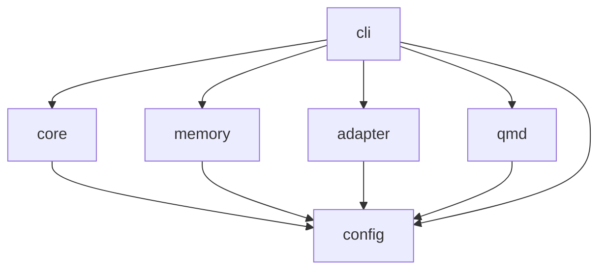

# Developer Guide

## Monorepo Structure

```
sndv-nano/
├── packages/
│   ├── config/     — Enums, types, constants, error factories
│   ├── core/       — Protocol, DoubleLoop, scheduler, runner
│   ├── memory/     — 3-tier memory (short-term, session, long-term)
│   ├── adapter/    — LLM client, prompt builder, opencode adapter
│   ├── qmd/        — QMD parser, knowledge graph, search
│   └── cli/        — CLI commands (init, run, status, memory)
├── examples/                                 — Working examples by domain
├── tsconfig.json                             — Root config with path aliases
└── package.json                              — Workspace root, scripts
```

## Dependency Graph



All packages depend on `config`. The `cli` depends on everything. No circular dependencies.

## Adding a New Package

1. Create the directory:
   ```bash
   mkdir -p packages/mypkg/src packages/mypkg/test
   ```

2. Create `packages/mypkg/package.json`:
   ```json
   {
     "name": "@thecharge/sndv-mypkg",
     "version": "0.1.0",
     "type": "module",
     "main": "src/index.ts",
     "types": "src/index.ts",
     "dependencies": {
       "@thecharge/sndv-config": "workspace:*"
     }
   }
   ```

3. Create `packages/mypkg/tsconfig.json`:
   ```json
   {
     "extends": "../../tsconfig.json",
     "compilerOptions": {
       "composite": true,
       "outDir": "dist",
       "rootDir": "src",
       "declaration": true,
       "declarationMap": false
     },
     "include": ["src"],
     "references": [
       { "path": "../config" }
     ]
   }
   ```

4. Add path alias to root `tsconfig.json`:
   ```json
   "@thecharge/sndv-mypkg": ["./packages/mypkg/src/index.ts"]
   ```

5. Add project reference to root `tsconfig.json`:
   ```json
   { "path": "packages/mypkg" }
   ```

6. Run `bun install` to link the workspace package.

## Using Packages in the Monorepo

Import using the package name, never relative paths:

```typescript
// ✅ Correct
import { TaskStatus, SmepErrors } from "@thecharge/sndv-config";
import { Protocol, summary } from "@thecharge/sndv-nano";
import { MemoryRepository } from "@thecharge/sndv-memory";
import { QmdKnowledgeGraph } from "@thecharge/sndv-qmd";

// ❌ Wrong — never use relative paths to other packages
import { Protocol } from "../../packages/core/src/index";
```

## Code Conventions

| Rule | Example |
|------|---------|  
| **≤ 300 lines per file** | Split into modules if approaching limit |
| **Max 2 nesting levels** | Extract helpers or use early return |
| **No `else if`** | Use early `return`/`continue` instead |
| Const arrow functions only | `export const run = async () => { ... };` |
| No `function` declarations | Use `const fn = () => {}` |
| No `switch/case` | Use early returns with `if` |
| Early return / early continue | Guard clause at top, happy path at bottom |
| Descriptive variable names | `memoryRepository` not `mem`, `hypothesisId` not `hId` |
| Enums from config | `TaskStatus.VERIFIED` not `"verified"` |
| Errors from factory | `throw SmepErrors.protocolEmpty()` not `throw new Error(...)` |
| No `.js` in imports | `from "./parser"` not `from "./parser.js"` |
| Types in config package | All shared types live in the config package |

## Common Commands

```bash
# Install dependencies
bun install

# Run all tests
bun test --recursive

# Type check all packages
bun run typecheck

# Lint all files
bun run lint

# Fix lint issues
bun run lint:fix

# Full validation (lint + typecheck + test)
bun run check

# Run a specific example
bun run examples/greenfield/feature.ts

# Run the CLI
bun run packages/cli/src/index.ts init my-project
bun run packages/cli/src/index.ts run
bun run packages/cli/src/index.ts status
bun run packages/cli/src/index.ts memory --patterns
```

## LLM Configuration

SNDV is vendor-agnostic. Provider is auto-detected from the base URL. Configure via environment variables:

| Provider | `SNDV_LLM_BASE_URL` | `SNDV_LLM_MODEL` | Auth |
|---|---|---|---|
| Ollama (default) | `http://localhost:11434/v1` | `llama3` | none |
| OpenAI | `https://api.openai.com/v1` | `gpt-4o-mini` | `sk-...` |
| Google Gemini | `https://generativelanguage.googleapis.com/v1beta/openai` | `gemini-2.0-flash` | Google API key |
| xAI Grok | `https://api.x.ai/v1` | `grok-2` | `xai-...` |
| Anthropic Claude | `https://api.anthropic.com` | `claude-sonnet-4-20250514` | `sk-ant-...` |
| OpenRouter | `https://openrouter.ai/api/v1` | `anthropic/claude-sonnet-4-20250514` | `sk-or-v1-...` |
| Together AI | `https://api.together.xyz/v1` | `meta-llama/Llama-3.3-70B-Instruct-Turbo` | key |
| LM Studio | `http://localhost:1234/v1` | `local-model` | none |

Anthropic uses native Messages API (auto-detected). All others use OpenAI-compatible format.
OpenRouter adds `HTTP-Referer` and `X-Title` headers automatically.

```bash
# Example: Google Gemini
export SNDV_LLM_BASE_URL="https://generativelanguage.googleapis.com/v1beta/openai"
export SNDV_LLM_API_KEY="your-google-api-key"
export SNDV_LLM_MODEL="gemini-2.0-flash"
```

## Memory Persistence

All memory is stored as **JSONL** (one JSON object per line):

| File | Format | Write pattern |
|---|---|---|
| `evidence.jsonl` | JSONL | Append-only (no read-before-write) |
| `decisions.jsonl` | JSONL | Append-only |
| `patterns.jsonl` | JSONL | Read/rewrite (small file, needs dedup) |
| `constraints.jsonl` | JSONL | Read/rewrite (small file) |
| `session.json` | JSON | Atomic overwrite (small metadata) |

Append-only writes prevent memory leaks and corruption. Use `appendJsonlBatch()` for evidence and decisions.
Use `readJsonl()` / `writeJsonl()` for patterns and constraints.

## QMD Knowledge Graph

The QMD package provides document parsing, a knowledge graph, and search:

```typescript
import { QmdKnowledgeGraph } from "@thecharge/sndv-qmd";

const graph = new QmdKnowledgeGraph();

// Index a directory of .qmd files
await graph.indexDirectory("./protocols");

// Search by text, frontmatter, task name, risk threshold, or tags
const results = graph.search({ text: "authentication", minRisk: 0.9 });

// Find cross-document dependencies
const dependents = graph.getDependents("auth.qmd");

// Persist the index
await graph.saveIndex(".sndv/qmd-index.json");
```
