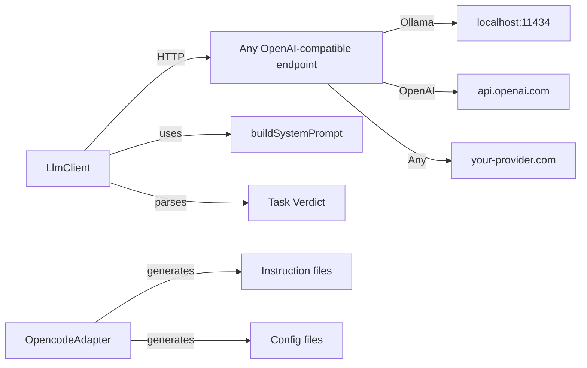

# @thecharge/sndv-adapter

Vendor-agnostic LLM adapter for SMEP task evaluation.

## Architecture



## Usage

### LLM Client

```typescript
import { LlmClient, buildSystemPrompt } from "@thecharge/sndv-adapter";

// Reads SNDV_LLM_API_KEY, SNDV_LLM_BASE_URL, SNDV_LLM_MODEL from env
const client = new LlmClient();

const verdict = await client.judgeTask(systemPrompt, "verify_latency", description, memoryContext);
// { status: "verified" | "falsified", reason: "...", evidence: {...} }
```

### opencode Integration

```typescript
import { OpencodeAdapter } from "@thecharge/sndv-adapter";

const adapter = new OpencodeAdapter();
const instruction = adapter.toInstruction(goal, constraints, tasks);
// -> Save to .opencode/smep-context.md
```

## Configuration

No vendor lock-in. Set environment variables:

| Variable | Default | Description |
|----------|---------|-------------|
| `SNDV_LLM_API_KEY` | (none) | API key for the LLM provider |
| `SNDV_LLM_BASE_URL` | `http://localhost:11434/v1` | Base URL (Ollama default) |
| `SNDV_LLM_MODEL` | `default` | Model name |
