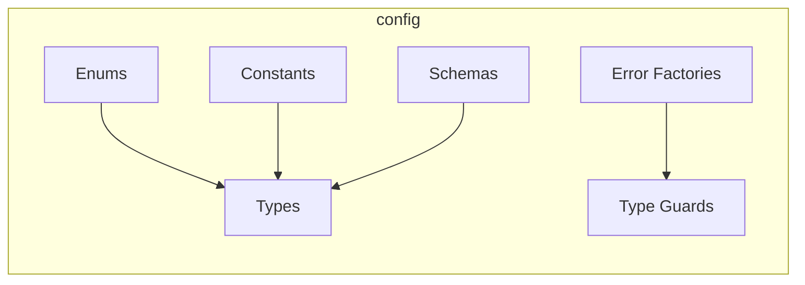

# @thecharge/sndv-config

Centralized enums, types, constants, Zod schemas, and error factories for the SNDV monorepo.

## What's Inside



### Enums

| Enum | Values |
|------|--------|
| `TaskStatus` | `PENDING`, `RUNNING`, `VERIFIED`, `FALSIFIED`, `ERRORED`, `SKIPPED`, `TIMED_OUT` |
| `LoopPhase` | `FALSIFY`, `DELIVER`, `VERIFY` |
| `ProtocolOutcome` | `VERIFIED`, `FALSIFIED`, `ERRORED` |
| `LoopOutcome` | `VERIFIED`, `FALSIFIED`, `IN_PROGRESS` |
| `ProjectType` | `GREENFIELD`, `BROWNFIELD` |
| `ChatRole` | `SYSTEM`, `USER`, `ASSISTANT` |
| `VerdictStatus` | `VERIFIED`, `FALSIFIED` |
| `DecisionAction` | `VERIFIED`, `FALSIFIED`, `ERRORED`, `TIMED_OUT`, `SKIPPED` |

### Error Factories

```typescript
import { SmepErrors, isFalsificationError } from "@thecharge/sndv-config";

throw SmepErrors.protocolEmpty();
throw SmepErrors.duplicateTask("my_task");
throw SmepErrors.falsification("too slow", { latency_ms: 500 });

try { ... } catch (e) {
  if (isFalsificationError(e)) { /* handle */ }
}
```

### Constants

Environment variables: `ENV_LLM_API_KEY`, `ENV_LLM_BASE_URL`, `ENV_LLM_MODEL`
Defaults: `DEFAULT_LLM_MODEL = "default"`, `DEFAULT_LLM_BASE_URL = "http://localhost:11434/v1"`
