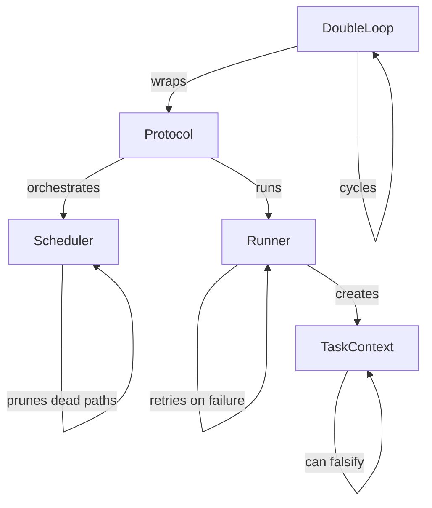

# @thecharge/sndv-nano

Core SMEP (Self-Managing Execution Protocol) engine.

## Architecture



## Usage

### Simple Protocol

```typescript
import { Protocol, summary, type TaskContextInterface } from "@thecharge/sndv-nano";

const protocol = new Protocol({
  goal: "Migrate auth to sessions",
  constraints: ["Zero downtime", "No API changes"],
});

protocol.addTask(async (ctx: TaskContextInterface) => {
  const latency = await benchmarkSessions();
  ctx.evidence("p99_ms", latency);
  if (latency > 50) ctx.falsify("Too slow");
}, { name: "verify_latency", risk: 0.95 });

const report = await protocol.execute();
console.log(summary(report));
```

### Double Loop (Falsify → Deliver → Verify)

```typescript
import { DoubleLoop, type TaskContextInterface } from "@thecharge/sndv-nano";

const loop = new DoubleLoop({ goal: "Build auth" }, { maxCycles: 3 });
loop.addFalsify(async (ctx) => { ... }, { name: "attack_assumption" });
loop.addDeliver(async (ctx) => { ... }, { name: "build_feature" });
loop.addVerify(async (ctx) => { ... }, { name: "verify_result" });

const cycles = await loop.run();
console.log(loop.summarize());
```
