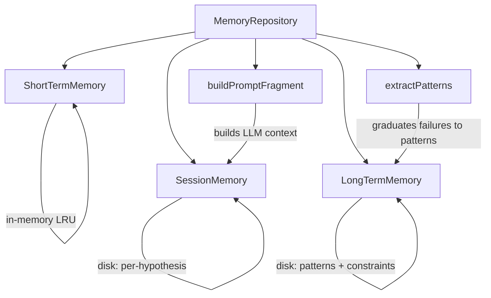

# @thecharge/sndv-memory

3-tier memory system for SMEP: short-term, session, and long-term.

## Architecture



## Tiers

| Tier | Storage | Scope | Purpose |
|------|---------|-------|---------|
| **Short-term** | In-memory (LRU) | Current run | Fast key-value cache, auto-evicts |
| **Session** | Disk (JSON) | Per-hypothesis | Run history, decisions, evidence |
| **Long-term** | Disk (JSON) | Cross-hypothesis | Institutional patterns, constraints |

## Usage

```typescript
import { MemoryRepository } from "@thecharge/sndv-memory";

const repo = new MemoryRepository({ root: ".sndv" });
await repo.init();

// Record a run
await repo.sessions.recordRun("auth-v2", { goal, status, durationMs, ... });

// Load context for LLM
const context = await repo.exportForLlm("auth-v2");

// Graduate patterns from repeated failures
const newPatterns = await repo.graduatePatterns();
```
