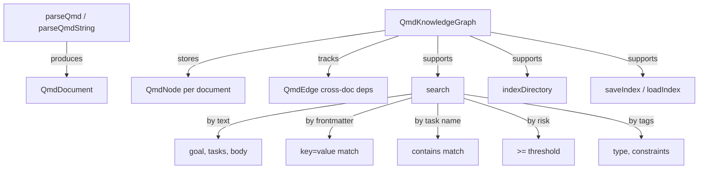

# @thecharge/sndv-qmd

QMD (Query Markup Documents) parser, knowledge graph, and search engine.

## Architecture



## QMD Format

```markdown
---
goal: Migrate auth to sessions
type: brownfield
max_iterations: 10
constraints:
  - Zero downtime
  - No API changes
---

# Task: verify_session_latency
risk: 0.95

Check that session store p99 < 50ms.

# Task: test_dual_write
risk: 0.8
depends_on: [verify_session_latency]

Verify dual-write consistency during migration.
```

## Usage

### Parsing

```typescript
import { parseQmd, parseQmdString } from "@thecharge/sndv-qmd";

const doc = await parseQmd("protocol.qmd");
const doc2 = parseQmdString(rawString);
```

### Knowledge Graph

```typescript
import { QmdKnowledgeGraph } from "@thecharge/sndv-qmd";

const graph = new QmdKnowledgeGraph();

// Index a directory of .qmd files
await graph.indexDirectory("./protocols");

// Add individual documents
graph.addDocument("auth.qmd", rawContent);

// Search
const results = graph.search({ text: "authentication", minRisk: 0.9 });
const byTag = graph.search({ tags: ["brownfield"] });
const byTask = graph.search({ taskName: "verify_latency" });

// Graph traversal
const dependents = graph.getDependents("auth.qmd");
const dependencies = graph.getDependencies("deploy.qmd");
const owner = graph.findDocumentByTask("verify_session_latency");

// Persistence
await graph.saveIndex(".sndv/qmd-index.json");
await graph.loadIndex(".sndv/qmd-index.json");
```

### Search Query Options

| Field | Type | Description |
|-------|------|-------------|
| `text` | `string` | Free-text search across goal, tasks, body |
| `frontmatter` | `Record<string, unknown>` | Match frontmatter key=value pairs |
| `taskName` | `string` | Match documents containing this task (substring) |
| `minRisk` | `number` | Match documents with tasks at or above this risk |
| `tags` | `string[]` | Match documents tagged with these values |
| `limit` | `number` | Maximum results (default: 50) |
